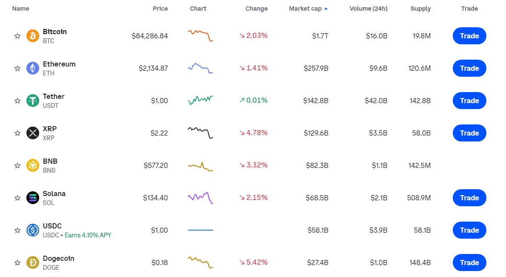

**What is NovaX?**

To begin, we should make clear the distinctions between the different areas of "NovaX", some of which may confuse new users.

- **The NovaX Protocol**: A suite of persistent, non-upgradable smart contracts that together create an automated market maker, a protocol that facilitates peer-to-peer market making and swapping of ERC-20, BEP-20 tokens , Bridge on the EVM Chain and BITCOIN.
- **The NovaX Interface**: A web interface that allows for easy interaction with the Uniswap protocol. The interface is only one of many ways one may interact with the Uniswap protocol.
- **NovaX Governance**: A governance system for governing the NovaX Protocol, enabled by the NVX token.
- **NovaX Node.js Version**: NovaX needs Node.js version 18 or 20.

**UItraX Exchange:**

NovaX Exchange is a Decentralized Trading & Exchange platform designed to provide a transparent, trustless, and fully on-chain trading platform.
With the core being an on-chain orderbook matching engine, NovaX Exchange helps traders to have full control over their orders while reducing transaction costs and remains the same trading experience in a Centralized Exchange.
V1 is built for EVM blockchains and is completely permissionless. Partners can work with Position Exchange’s on-chain central orderbook to share liquidity and power unique features for a better user experience.

V2 will support follow things:

- Swap
In the Swap of NovaX Interface, the EVM tokens (ERC-20, BEP-20) are supported.
- Bridge
    
    NovaX Bridge is software protocols that **facilitate the movement of assets and data between different blockchain networks**, enabling interoperability within the decentralized finance ecosystem. EVM tokens (Ethereum, BSC, Polygon, Arbitrum, Optimism) NVX Governance token, Internet Computer and Bitcorn are available.
    

**Website:**

The website contains modules like Trade, Dashboard, Earn and Buy.

1. Trade
In the Trade Page, User can see the trading view graph of each Tokens you selected.
    - Current Token Price, Token Volume and High / Low Price for 24 hours
    - Trading History and Wallet Position of Trading, Sell / Buy Token Orders
    
    In the Exchange section of Trading page, user can select Tokens, Amount, Leverage, Exchange Action Type.
    The Tokens and Amount of Wallet will be auto-placeholder in the Max and Token lists
    
2. Dashboard
    
    The dashboard page displays the current status of NovaX Exchange.
    
    - 24h Volume
    - Open Interest
    - Long Positions
    - Short Positions
    - Overview of Pool
    - Total Stats of Exchange
    - Stats of governance Token (NVX and ULP)
    - ULP / NVX Index Composition (Pair of Liquidity Pool)
3. Earn
    
    This Page is for Staking NVX/ULP Token & Earning Rewards(esNVX).
    
    - Overview of connected Wallet
        
        Owned NVX, esNVX, ULP, Claimable Rewards
        
        - User can Buy Tokens for Staking
        - Unstake Tokens from Each Pool
        - Claim Reward Tokens of Each Pool.
    - Overview of Staking Pools
        
        Example: NVX Staking Pool - Reward esNVX & U2U
        
        - Total Staked Tokens of each Pool
        - Reward Token Price
        - Total Supply of the Reward Token
        - APR / Multiplier Point APR
        - Staked Multiplier Points (Referral System)
    - Vault Vesting
    Convert Rewards to NVX
        - Deposit Rewards to the Pool
        - Withdraw Rewards to the Pool
        - Claim NVX
4. Buy
    
    User easily buy NVX or ULP using his favorite payment methods
    
    NVX is the utility and governance token. Accrues 30% of the platform's generated fees.
    
    ULP is the liquidity provider token. Accrues 70% of the platform's generated fees.
    
    - NVX
        - buy NVX from Decentralized Exchanges.
        There are many links of Decentralized Exchanges here
        - Buy NVX from Centralized Services
            
            There are many links of Centralized Exchanges here
            
    - ULP
        
        User can buy / Sell ULP from NovaX Exchange direactly.
        
        - Sell / Buy Listed Token (ETH, USDT, BTC, BNB)
5. NovaX Faucet
6. NovaX Doc
